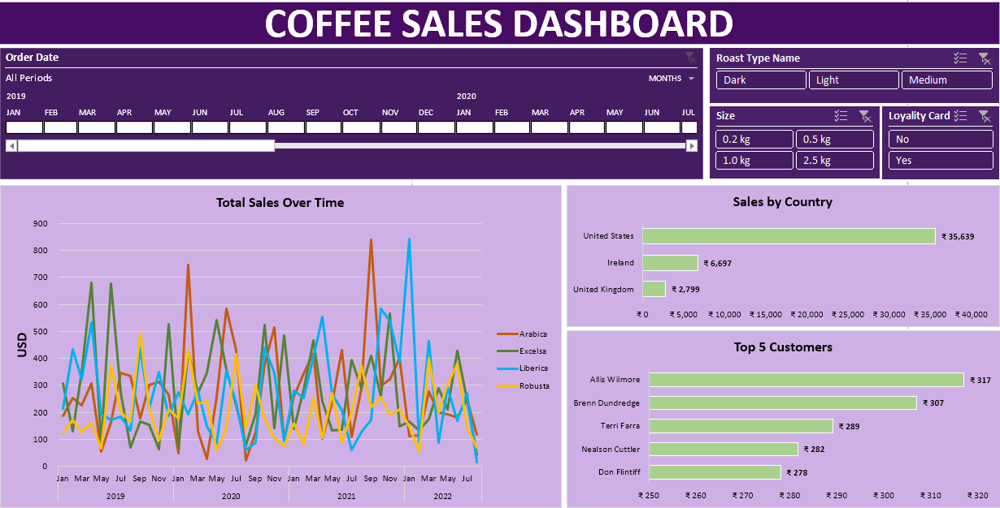

☕ Coffee Sales Analysis-

This project is an interactive Coffee Sales Dashboard created using Excel. The dashboard provides an analytical view of coffee sales across multiple dimensions such as time, geography, product type, and customer segmentation. It allows business stakeholders to monitor sales performance, identify top-performing products, and analyze customer behavior.

📷 Dashboard Preview

Here’s a snapshot of the Coffee Sales Dashboard:

📊 Dashboard Overview

The Coffee Sales Dashboard helps answer key business questions:

How have total sales trended over time?

Which countries contribute the most to sales revenue?

Who are the top customers driving sales?

How do roast type, packaging size, and loyalty programs affect sales?

The dashboard combines time-series analysis, categorical breakdowns, and customer insights to provide a comprehensive view of coffee sales.

🚀 Key Features

1. Time Analysis

Sales tracked monthly and yearly from 2019 to 2022.

Line chart of Total Sales Over Time broken down by coffee types:

Arabica

Excelsa

Liberica

Robusta

2. Geographic Analysis

Sales by Country visualization highlights key markets:

United States as the largest contributor with revenue of ₹35,639.

Ireland generating ₹6,697.

United Kingdom with ₹2,799.

3. Customer Analysis

Top 5 customers by sales volume displayed:

Allis Wilmore (₹317)

Brenn Dundredge (₹307)

Terri Farra (₹289)

Nealson Cuttler (₹282)

Don Flintiff (₹278)

4. Filters for Deeper Insights

Order Date Filter (by year, month, or custom period).

Roast Type filter (Dark, Light, Medium).

Packaging Size filter (0.2 kg, 0.5 kg, 1.0 kg, 2.5 kg).

Loyalty Card filter (Yes / No).

These filters make the dashboard dynamic and adaptable for different analysis perspectives.

🛠️ Tools & Technologies Used

Excel (Pivot Tables, Charts, Slicers, Timelines, and Formatting)

Data Cleaning (removing duplicates, handling missing data, formatting columns)

Data Visualization (custom charts and interactive filters)

📈 Insights & Observations

Arabica and Robusta are the most consistent performers over time.

The United States dominates sales compared to other regions, showing potential for targeted marketing.

Loyalty cards and larger pack sizes (1.0 kg & 2.5 kg) appear to drive higher sales.

Top customers contribute significantly, suggesting the importance of retention strategies.
